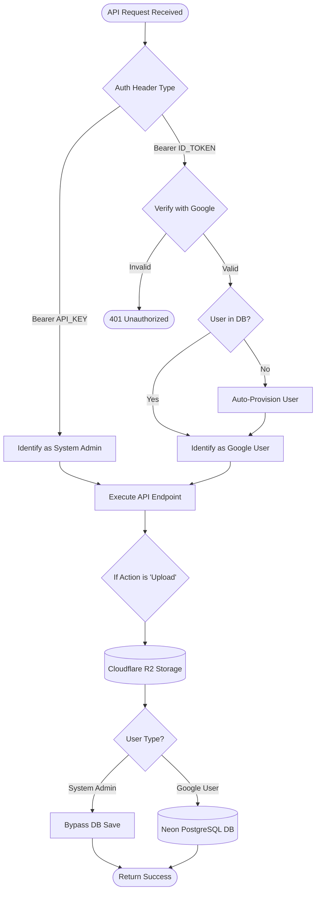

# Authentication Flow — Mistral PDF Summarizer

## Overview
The application uses a **Dual-Verification System** for API security. The FastAPI backend can identify a user through two different methods:
1. **Google ID Token** (Production Flow): Verified via Google's OAuth2 servers.
2. **Secret API Key** (Development/Testing Flow): Bypasses Google logic for faster internal testing.

---

## Authentication Logic

---

## 🔐 Security Components

### 1. Bearer Token
All authenticated requests must include the `Authorization` header:
- **Format:** `Authorization: Bearer <token_string>`

### 2. Frontend Lifecycle
- The frontend uses `NextAuth.js` to manage the lifecycle of the Google Session.
- Every API call to the backend uses a custom Axios/Fetch wrapper that attaches the `id_token`.

### 3. Backend Middleware (`backend/middleware/auth.py`)
- **Immutability:** The middleware ensures that once a user is authenticated, their `user_id` is passed down to the route handlers.
- **Auto-Provisioning:** If a new user logs in via Google for the first time, the backend automatically provisions their account in the database.

---

## 🛠️ Testing via Swagger
1. Navigate to `https://api.botzcoder.com/docs`.
2. Click **"Authorize"** on the top right.
3. Enter your **`API_KEY`** (found in `.env`).
4. Click **"Authorize"** and you can now test all protected routes as a System Admin.
